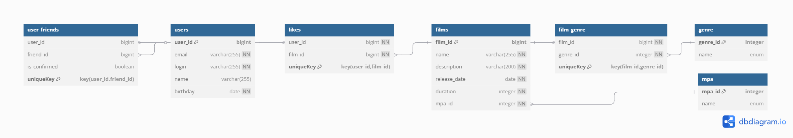

# 📽️ Filmorate — фильмы, которые заставят тебя забыть о холодильнике.

Filmorate — это REST-сервис для оценки фильмов с поддержкой пользователей, 
рейтингов, лайков и рекомендаций.

## 📖 Описание
Filmorate — это Java-приложение с открытым API, позволяющее:

- ✅ Хранить фильмы и пользователей

## 🔧 Возможности

- ✅ Добавление и удаление фильмов
- ✅ Добавление и удаление пользователей
- ✅ REST API с валидацией
- ✅ Хранение данных в базе данных (H2)
- ✅ Инициализация схемы через `schema.sql` и `data.sql`
- ✅ Работа с лайками, рейтингами, жанрами
- ✅ Проверка бизнес-логики через модульные и интеграционные тесты

---

## 🛠️ Технологии

- **Java**
- **Spring Boot**
- **Spring JDBC**
- **H2 Database**
- **Maven**
- **SLF4J / Logback**
- **Lombok**
- **JUnit / Mockito**
- **SQL (schema.sql, data.sql)**

## 🗃️ ER-диаграмма базы данных

## 👨‍💻 Контакты
Автор: Александр Викторов  
Email: dolsa.broadstaff@gmail.com  
GitHub: https://github.com/Novacancy531

